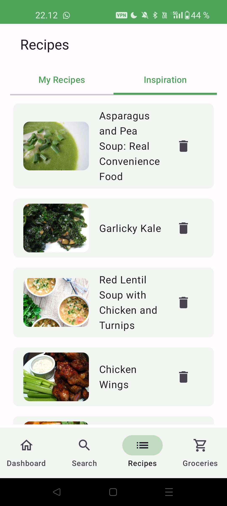
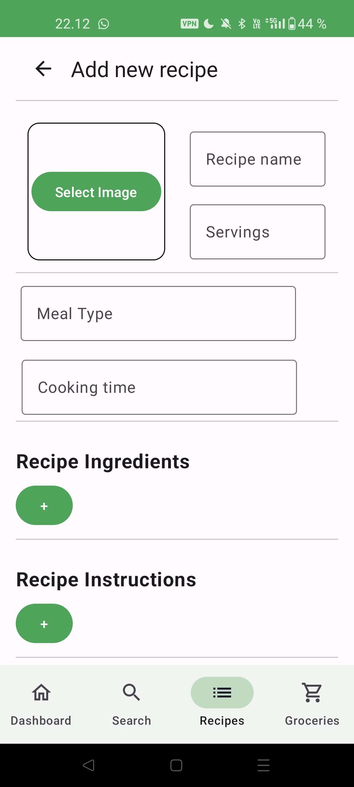
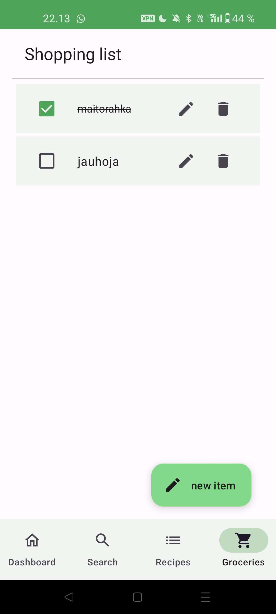

# Recipe App

<!-- Table of Contents -->

## Table of Contents

- [Description](#Description)
- [Built With](#Built-With)
- [Usage](#Usage)
- [Contact](#Contact)
  <!-- /Table of Contents -->

## Description

Recipe App is a simple android mobile app for managing and adding your own recipes. 
Application also has a feature to manage your shopping list.

<div align="center">
<code></code>
<code></img></code>
<code></div></code>

### Inspiration Recipes

Fetch recipes from [Spoonacular API](https://spoonacular.com/) and save your favorites to your inspiration log.

	
### Personal Recipes
Create your own recipes with images. Add tags, and 

### Shopping List
Manage your shopping list by adding ingredients and every day necessities. 

The focus is to have a simple UI and a user friendly feel.

## Build-with

<div align="center">
	<code></code>
	<code></code>
	<code></code>
</div>

## Usage

To start developing:

1. Clone the repo
   ```sh
   git clone https://github.com/Noorae/Learn-languages-app.git
   ```
2. Open  project in Android Studio
   ```sh
   cd recipe-application
   ```
3. Get your SpoonAcular API token and add it to a .properties file
   ```
   API_KEY=your_spoonacular_api_key
   ```

To download and use the app, download and install the apk in the Release tab

## Contact

This project was developed as part of the BBA Information Technology
mobile development course at Tampere University of Applied Sciences.

Developed by Noora Vainionpää noora_vain@hotmail.com [Email](noora_vain@hotmail.com)

[Screencast video](https://youtu.be/YQgobxh1Cz8)
